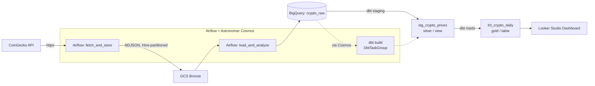
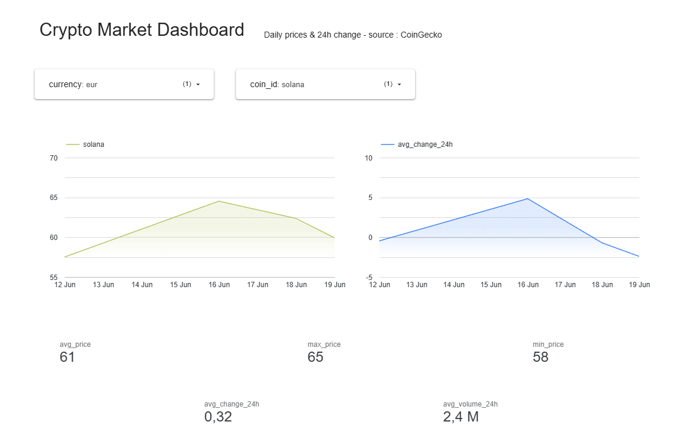

# Crypto Market Data Pipeline

An end-to-end **ELT data pipeline** that ingests cryptocurrency prices from the CoinGecko API every hour, lands them in a cloud data warehouse, transforms them with dbt into an analytics-ready model, and serves the result through a live dashboard.

Built to demonstrate production-shaped data engineering: orchestration, the medallion architecture, data quality testing, and dependency isolation.

---

## Architecture



**Flow:** CoinGecko → Airflow → GCS (bronze) → BigQuery (raw) → dbt (silver → gold) → Looker Studio, orchestrated hourly by Airflow.

---

## Tech Stack

| Layer | Tools |
|---|---|
| Ingestion | Python, `httpx` |
| Orchestration | Apache Airflow 2.9.2, Docker Compose |
| dbt integration | Astronomer Cosmos (dbt isolated in its own venv) |
| Storage (bronze) | Google Cloud Storage (NDJSON, Hive partitioning) |
| Warehouse | Google BigQuery |
| Transformation | dbt Core (`dbt-bigquery`) |
| Visualization | Looker Studio |
| Testing | pytest, respx |

---

## Features

- **Hourly ingestion** of 4 coins (Bitcoin, Ethereum, Solana, BNB) across 6 currencies (USD, IDR, CNY, JPY, EUR, SGD)
- **Medallion architecture** — bronze (raw NDJSON in GCS) → silver (cleaned dbt views) → gold (aggregated dbt tables)
- **Hive-partitioned storage** (`year=/month=/day=/`) for efficient, organized object storage
- **Data quality tests** at two layers — dbt schema tests (`not_null`, `accepted_values`) and a Python `pytest` suite
- **Model-level observability** — Cosmos renders each dbt model and test as its own Airflow task
- **Dependency isolation** — dbt runs in a separate venv to avoid Airflow/dbt dependency conflicts
- **Local runner** (`main.py`) to execute the ingestion flow without spinning up Airflow

---

## Data Model

| Layer | Object | Type | Description |
|---|---|---|---|
| Bronze | `gs://<bucket>/bronze/crypto_prices/...` | NDJSON | Raw API responses, Hive-partitioned |
| Raw | `crypto_raw.crypto_prices` | BigQuery table | Bronze loaded into the warehouse |
| Silver | `stg_crypto_prices` | dbt view | Cleaned: Unix `last_updated` → `TIMESTAMP` |
| Gold | `fct_crypto_daily` | dbt table | Daily aggregates per coin × currency: avg / max / min price, avg 24h change, avg 24h volume |

**Grain of `fct_crypto_daily`:** one row per `coin × currency × day`.

---

## Project Structure

```
crypto-market-pipeline/
├── airflow/dags/
│   └── crypto_market_dag.py     # the DAG: fetch -> load -> dbt build (Cosmos)
├── ingestion/
│   ├── coingecko_client.py      # CoinGecko API client
│   └── storage.py               # pluggable storage backends (local / GCS) via Protocol
├── dbt/crypto_pipeline/
│   ├── models/staging/          # silver layer (stg_crypto_prices)
│   └── models/marts/            # gold layer (fct_crypto_daily)
├── tests/
│   ├── test_storage.py          # LocalStorageBackend tests
│   └── test_coingecko_fetch.py  # API client tests (respx-mocked)
├── main.py                      # local runner (no Airflow needed)
├── Dockerfile                   # custom Airflow image (Cosmos + isolated dbt venv)
├── docker-compose.yml
├── requirements.txt             # runtime deps
├── requirements-dev.txt         # + test deps
└── .env.example                 # config template (copy to .env)
```

---

## Setup & Running

### Prerequisites
- Docker & Docker Compose
- A GCP project with BigQuery + a GCS bucket
- A GCP service-account key with BigQuery + Storage access

### 1. Configure environment
```bash
cp .env.example .env          # then fill in your values
```
Place your service-account key at `secrets/gcp-credentials.json` (gitignored).

### 2. Start the stack
```bash
docker compose up -d
```
Airflow UI: http://localhost:8080 (credentials from your `.env`).
Unpause the `crypto_data_pipeline` DAG to begin hourly ingestion.

### 3. Run the tests
```bash
python -m venv .venv
.venv/Scripts/activate          # Windows  (use source .venv/bin/activate on macOS/Linux)
pip install -r requirements-dev.txt
pytest -v
```

### 4. Run ingestion locally (without Airflow)
```bash
python main.py
```

---

## Dashboard

<!-- TODO: add a screenshot — save it to docs/dashboard.png and it will render here -->


A Looker Studio dashboard connected to `fct_crypto_daily`, with currency and coin filters, a price-trend time series, a scale-free 24h-change comparison, and KPI scorecards.

---

## Future Improvements

<!-- TODO: make these YOUR priorities -->
- Incremental dbt models to process only new data
- CI/CD (GitHub Actions) to run `pytest` and `dbt build` on every push
- Data-freshness / gap alerting (the pipeline currently has no monitoring)
- Expand coverage to more coins and historical backfill
- Promote dev → prod with separate dbt targets and BigQuery datasets
